# gps_denied_navigation_sim

Simulation environment that can be used for GPS-denied navigation frameworks.

## How to Generate DEM for Gazebo

### Dependencies

* Ubuntu 22.04
* ROS 2 humble + Gazebo garden
* PX4 Atuopilot 
* Blender
* Blender GIS 

### Installation

#### 1. Simulation Development Environment Docker Image

A Docker image for the simulation development environment is available at [gps_denied_navigation_docker](https://github.com/riotu-lab/gps_denied_navigation_docker.git). It includes Ubuntu 22.04, ROS 2 Humble + Gazebo Garden, and PX4 Autopilot.

#### 2. Blender

You can do this step outside the docker container. Make sure you have Blender version 3.6.0. Download it [here](https://download.blender.org/release/Blender3.6/), select `blender-3.6.0-linux-x64.tar.xz`, wait for it to download, and unzip it.

```bash
cd blender-3.6.0-linux-x64.tar.xz
./blender
```

### 3. Blender GIS 

Clone the BlenderGIS repository:
```bash
git clone https://github.com/domlysz/BlenderGIS
```

Note : Since 2022, the OpenTopography web service requires an API key. Please register to opentopography.org and request a key. This service is still free.

### Configuring Blender with BlenderGIS

1. Open Blender and remove the Cube, Camera, and Light. 

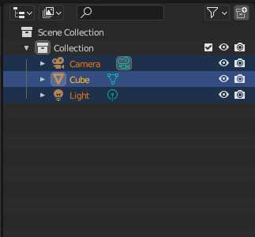
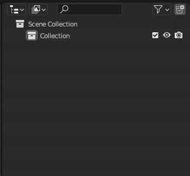

2. Add the Blender GIS plugin:
    * Go to `Edit` select `Preferences`. 
    * select `Install` and add the plugin path from the downloaded .zip file.
    * select 3D view: Blender GIS
      
    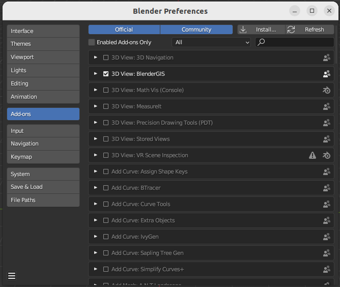
   
    * In the search tab, search for `node` and mark it as selected.
      
    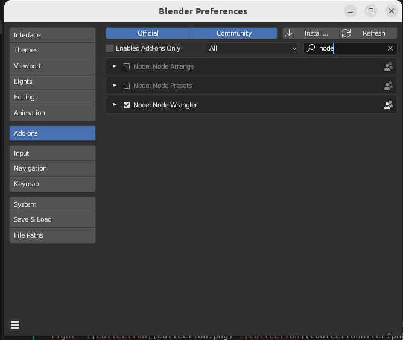

4. Close the window, and Blender GIS should be activated.

5. To create the `terrain`, use Blender GIS to import GIS data:
    * Go to the basemap and click `OK`.
      
    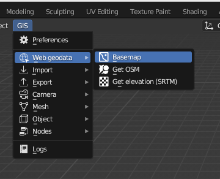
    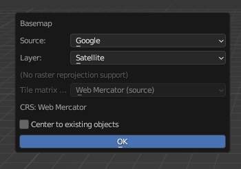
    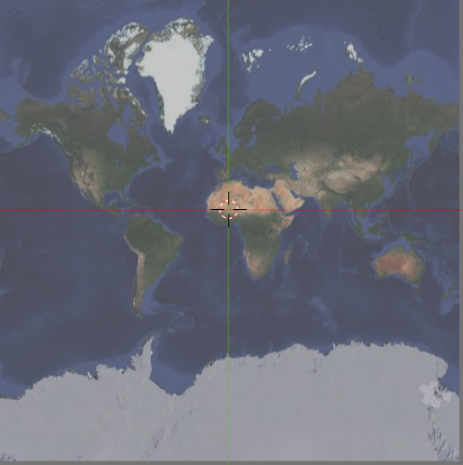

    * Press `G` to search a specific location on the map.
      
    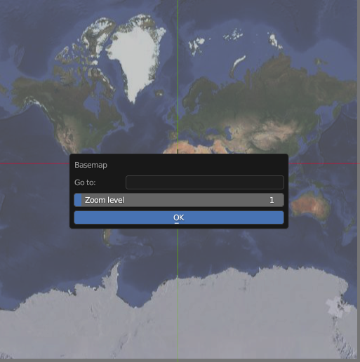

6. Choose a mountainous area (e.g., Mt. Wilder) and zoom in.
    
   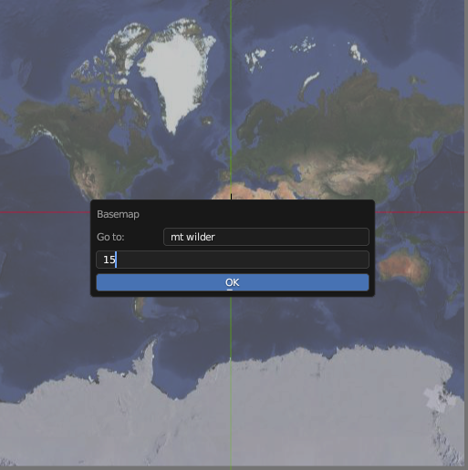


7. Select the region of interest (ROI) and press `E` to bring up the planar map of `Mt. Wilder`.

   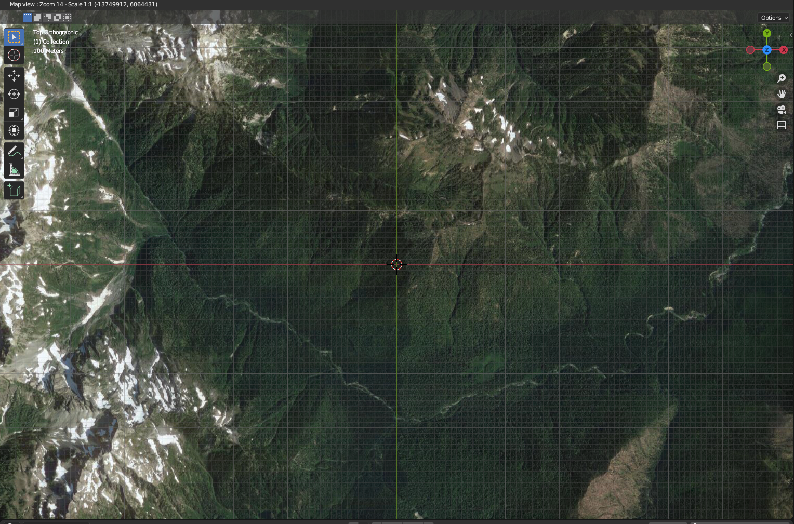
   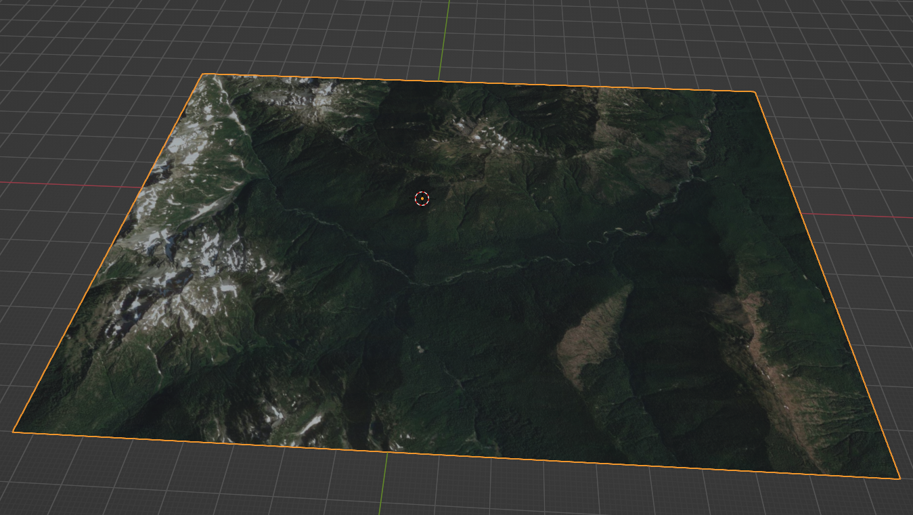


8. Get the elevation data:
    * Go to GIS, Web geodata, and select `Get elevation (SRTM)`.
    
   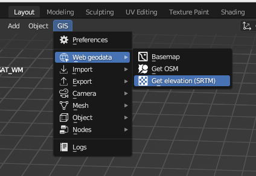

    * Choose the SRTM option (e.g., 'OpenTopography SRTM 30m').

9. Convert elevation to mesh:
    * Right-click and choose `Convert to` -> `Mesh`.
   
   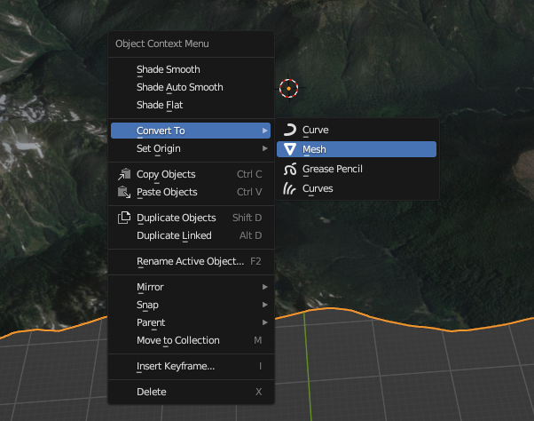

    * Switch to Edit Mode to find the DEM converted to mesh
    
   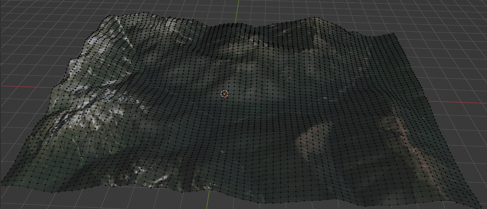

10. Export the DEM to a Collada file (.dae).

   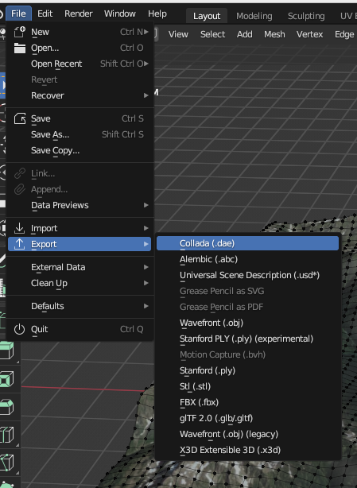

11. Copy the exported files (.dae and .tif) to your 'world' package.
>Note you need to export the model path 
```bash
export GZ_SIM_RESOURCE_PATH=/home/user/shared_volume/ros2_ws/src/gps_denied_navigation_sim/models
```

12. Create an SDF file for Gazebo:
 
```xml
<?xml version="1.0" ?>
<sdf version="1.5">
  <model name="dem">
    <pose>0 0 0 0 0 0</pose>
    <static>true</static>
    <link name="body">
      <visual name="visual">
        <transparency>0</transparency>
        <geometry>
          <mesh>
            <uri>media/dem.dae</uri>
            <scale>0.001121131 0.001121131 0.001121131</scale>
          </mesh>
        </geometry>

      </visual>
      <collision name="collision">
        <geometry>
          <mesh>
            <uri>media/dem.dae</uri>
            <scale>0.001121131 0.001121131 0.001121131</scale>
          </mesh>

        </geometry>
      </collision>
    </link>
  </model>
</sdf>
```
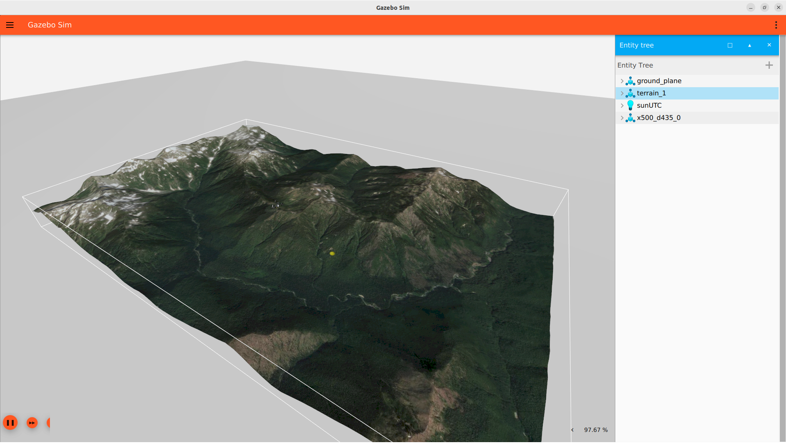


