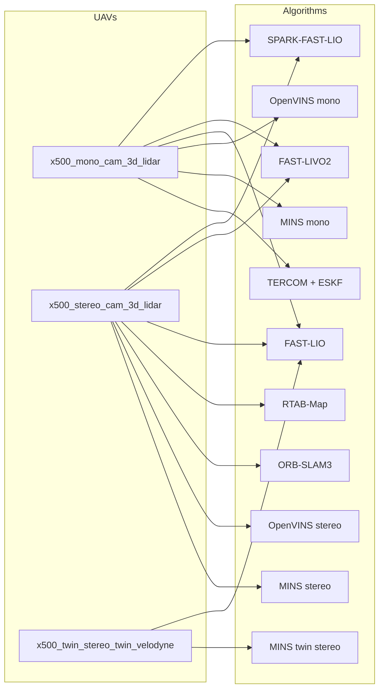

# Supported Localisation Algorithms

`gps_denied_navigation_sim` is algorithm-agnostic: the simulator publishes ground truth (MAVROS `/target/local_position/odom` + a sampled `/target/gt_path`), IMU, cameras, LiDARs, baro and GPS — any estimator that consumes standard `sensor_msgs` can be dropped in.

This page is the **hub**. Each algorithm has its own setup guide with clone/build commands and a ready-made alias in [`scripts/bash.sh`](../scripts/bash.sh).

---

## At a glance

| Algorithm | Type | Sensor suite | UAV model | World | Alias | Docs |
|-----------|------|--------------|-----------|-------|-------|------|
| **TERCOM + ESKF** | Terrain-aided INS | IMU + Baro + Rangefinder + DEM | `x500_mono_cam_3d_lidar` | `taif_test4` | `tercom` | [TERCOM](TERCOM.md) |
| **MINS** (mono) | Filter-based VIO | IMU + Mono camera | `x500_mono_cam_3d_lidar` | any | `mins_mono` | [mins/](mins/mins.md) |
| **MINS** (stereo) | Filter-based VIO | IMU + Stereo camera | `x500_stereo_cam_3d_lidar` | any | `mins_stereo` | [mins/](mins/mins.md) |
| **MINS** (twin stereo + LiDAR) | Tightly-coupled VIL | IMU + 4 cameras + 2 Velodyne | `x500_twin_stereo_twin_velodyne` | any | `mins_twin_stereo` | [mins/](mins/mins.md) |
| **OpenVINS** (mono) | Filter-based VIO | IMU + Mono camera | `x500_mono_cam_3d_lidar` | any | `mono_ov` | [openvins/](openvins/openvins.md) |
| **OpenVINS** (stereo) | Filter-based VIO | IMU + Stereo camera | `x500_stereo_cam_3d_lidar` | any | `stereo_ov` | [openvins/](openvins/openvins.md) |
| **FAST-LIO** | LiDAR-Inertial Odometry | IMU + 3D LiDAR | `x500_*_3d_lidar` | any | `fast_lio`, `outdoor_lio`, `taif_lio` | [fast_lio/](fast_lio/fast_lio.md) |
| **FAST-LIVO2** | LiDAR-Visual-Inertial | IMU + Camera + 3D LiDAR | `x500_*_3d_lidar` | any | `livo` | [fast_livo2/](fast_livo2/fast_livo2.md) |
| **SPARK-FAST-LIO** | LiDAR-Inertial (MIT-SPARK) | IMU + 3D LiDAR | `x500_*_3d_lidar` | any | `spark` | [spark/](spark/spark.md) |
| **RTAB-Map** | Graph SLAM | RGB-D / Stereo + LiDAR | `x500_stereo_cam_3d_lidar` | any | `rtmap` | [rtabmap/](rtabmap/rtabmap.md) |
| **ORB-SLAM3** | Feature-based VI-SLAM | IMU + Stereo camera | `x500_stereo_cam_3d_lidar` | any | `orb_slam` | [orb_slam/](orb_slam/orb_slam.md) |
| **KISS-Matcher** | Global LiDAR registration | 3D LiDAR | `x500_*_3d_lidar` | any | — | [kiss_matcher/](kiss_matcher/kiss_matcher.md) |
| **RESPLE** | Surface-point LiDAR odom. | 3D LiDAR | `x500_*_3d_lidar` | any | — | [resple/](resple/resple.md) |
| **SUPER** | LiDAR-inertial SLAM | IMU + 3D LiDAR | `x500_*_3d_lidar` | any | — | [super/](super/super.md) |

All aliases are defined in [`scripts/bash.sh`](../scripts/bash.sh). They automatically source the right companion workspace (`mins_ws`, `openvins_ws`, `lio_ws`, `livo2_ws`, `spark_ws`, `rtabmap_ws`, `orb_slam3_ws`).

---

## Recommended pairing (algorithm ↔ UAV model)



---

## Running a non-default algorithm

Every algorithm lives in its own workspace under `~/shared_volume/*_ws`. The general pattern is:

1. Launch the simulator + MAVROS with the UAV model/world you want (any `mono_*`, `stereo_*`, `twin_*` alias).
2. In a second terminal, source that algorithm's workspace and invoke its launch file via the alias.
3. Optionally start the `path_error_calculator` to record the estimator vs ground-truth error in real time (see [`ALGORITHM_ANALYSIS.md`](ALGORITHM_ANALYSIS.md)).

### Example — TERCOM (default)

```bash
# Terminal 1
zenoh

# Terminal 2
mono_taif4          # mono cam + 3D LiDAR on the taif_test4 world

# Terminal 3
tercom              # tercom_nav + diagnostics + rviz_tercom.rviz
```

### Example — MINS stereo on taif_test4

```bash
# Terminal 1
zenoh

# Terminal 2
stereo_taif4        # stereo cam + 3D LiDAR

# Terminal 3
mins_stereo         # sources mins_ws and runs ros2 run mins subscribe ...
```

### Example — FAST-LIO on the Velodyne drone

```bash
# Terminal 1
zenoh

# Terminal 2
twin_taif4

# Terminal 3
taif_lio            # fast_lio mapping.launch.py with taif_outdoor.yaml
```

---

## Adding your own algorithm

1. Build the estimator in its own colcon workspace under `~/shared_volume/<algo>_ws`.
2. Remap its topics to match what the simulator publishes (see [`ARCHITECTURE.md`](ARCHITECTURE.md#ros-topics-published-by-the-simulator) for a full topic list).
3. Add an alias to [`scripts/bash.sh`](../scripts/bash.sh) following the existing pattern.
4. Create `docs/<algo>/<algo>.md` with install/build steps.
5. Add a row to the tables above.
6. Run it head-to-head against TERCOM using the tooling in [`ALGORITHM_ANALYSIS.md`](ALGORITHM_ANALYSIS.md).

---

## See also

- [`UAV_MODEL.md`](UAV_MODEL.md) — which UAV exposes which sensors
- [`SIMULATION_ENVIRONMENT.md`](SIMULATION_ENVIRONMENT.md) — available worlds and how to spawn on a new one
- [`ALGORITHM_ANALYSIS.md`](ALGORITHM_ANALYSIS.md) — end-to-end performance comparison workflow
