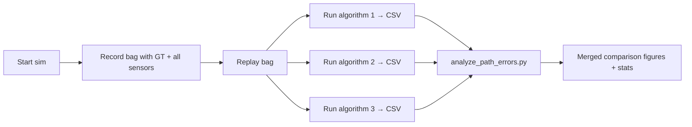

# Analyzing and Comparing Algorithms

This guide describes the end-to-end workflow for benchmarking a GPS-denied localisation algorithm against MAVROS ground truth and for comparing multiple algorithms head-to-head on the same flight.

Three complementary tools are shipped with the simulator:

| Tool | Scope | Output |
|------|-------|--------|
| **`path_error_calculator` + `run_path_error_analysis.py`** | Any pair of `nav_msgs/Path` topics | Live error topics + CSV + summary report |
| **`data_sync_recorder`** | Time-synchronised raw sensors | CSV + image folder (re-playable dataset) |
| **`analyze_tercom_log.py`** (from `tercom_nav`) | TERCOM-specific CSV from `diagnostics_node` | 15 publication-quality figures (PNG + PDF) |

For offline / bulk playback you can still `ros2 bag record` the full session and replay it later against each algorithm in turn.

---

## 0. Ground truth

Every launch file spawns [`gt_trajectory_publisher`](../gps_denied_navigation_sim/gt_trajectory_publisher.py), which accumulates MAVROS `local_position/pose` into a `nav_msgs/Path` published on:

```
/target/gt_path
```

This is the reference trajectory every estimator will be compared against.

---

## 1. Recording a single run

### 1a. Online error against ground truth (any algorithm)

Start the simulator + your estimator, then run:

```bash
# Launch the calculator node
ros2 run gps_denied_navigation_sim path_error_calculator

# Record a 60-second run
python3 scripts/run_path_error_analysis.py auto --duration 60

# Or manual control
python3 scripts/run_path_error_analysis.py start
# ... fly ...
python3 scripts/run_path_error_analysis.py stop
```

Default topic mapping:

- Ground truth: `/target/gt_path`
- Estimate:     `/mins/imu/path`  (remap with a launch argument to use another algorithm)

Full details, topics and CSV columns are documented in [`path_error_analysis.md`](path_error_analysis.md).

Live monitoring while recording:

```bash
ros2 topic echo /path_error/position_error    # metres
ros2 topic echo /path_error/orientation_error # radians
ros2 topic echo /path_error/velocity_error    # m/s
ros2 topic echo /path_error/cumulative_error  # running average
```

### 1b. TERCOM-specific run log

`diagnostics_node` in `tercom_nav` continuously writes `/tmp/tercom_logs/tercom_log_YYYYMMDD_HHMMSS.csv` when `log_to_csv: true` (default). Columns include `est_{x,y,z}`, `true_{x,y,z}`, per-axis error, TERCOM MAD / discrimination / roughness, covariance diagonal, NIS, and filter state.

### 1c. Synchronised sensor dataset

To build a **replayable** dataset (images + IMU + GPS + LiDAR + baro aligned on the same timestamps), use the `DataSyncRecorder`:

```bash
ros2 launch gps_denied_navigation_sim data_saver.launch.py
ros2 service call /data_sync_recorder/start_recording std_srvs/srv/SetBool "{data: true}"
# ... fly ...
ros2 service call /data_sync_recorder/stop_recording  std_srvs/srv/SetBool "{data: true}"
```

Output: `/home/user/shared_volume/data_recordings/recorded_data.csv` + PNG images. Columns documented in [`data_sync_recorder.py`](../gps_denied_navigation_sim/data_sync_recorder.py).

### 1d. Raw ROS 2 bag (fallback / largest coverage)

```bash
ros2 bag record -o /tmp/taif4_run \
    /tf /tf_static /clock \
    /target/mavros/imu/data /target/mavros/altitude \
    /target/mavros/distance_sensor/rangefinder_pub \
    /target/mavros/local_position/odom \
    /target/mavros/local_position/velocity_local \
    /target/mavros/global_position/global \
    /scan/points /target/camera /target/camera_info \
    /target/gt_path
```

Replay against any algorithm with `ros2 bag play --clock /tmp/taif4_run`.

---

## 2. Generating figures from a CSV

### 2a. Generic path-error CSV → figures

```bash
python3 scripts/analyze_path_errors.py /home/user/shared_volume/error_analysis/latest.csv
```

Produces summary statistics and publication-quality plots (trajectory XY, per-axis error vs. time, error histograms, cumulative error). Output directory is printed at the end of the run.

### 2b. TERCOM CSV → 15 figures

```bash
python3 $(ros2 pkg prefix tercom_nav)/share/tercom_nav/scripts/analyze_tercom_log.py \
    /tmp/tercom_logs/tercom_log_YYYYMMDD_HHMMSS.csv \
    --outdir /tmp/tercom_figures
```

Figures produced:

| # | Figure |
|---|--------|
| 01 | Trajectory XY (estimated vs truth) |
| 02 | Position error vs time (per-axis + horizontal + 3D) |
| 03 | Sliding-window RMSE / mean / max horizontal error |
| 04 | 3σ covariance bounds vs actual error |
| 05 | NIS vs time with χ² consistency lines |
| 06 | TERCOM quality (MAD / disc. / roughness / noise) |
| 07 | Speed profile (estimated vs true) |
| 08 | Filter state machine timeline |
| 09 | Horizontal / vertical error histograms |
| 10 | σ vs error scatter (consistency) |
| 11 | MAD vs position-error scatter |
| 12 | 3D trajectory |
| 13 | Cumulative accepted TERCOM fixes |
| 14 | Filter health metrics |
| 15 | Summary dashboard (single-page) |

---

## 3. Comparing multiple algorithms on the same flight

### Workflow



### Step-by-step

1. **Record once** with the bag command in §1d.
2. For each algorithm, spin a fresh shell and do:
   ```bash
   # Terminal A — replay
   ros2 bag play --clock /tmp/taif4_run

   # Terminal B — run estimator (e.g. MINS stereo)
   mins_stereo

   # Terminal C — record error CSV against /target/gt_path
   ros2 run gps_denied_navigation_sim path_error_calculator \
       --ros-args -p est_path_topic:=/mins/imu/path \
                  -p output_dir:=/home/user/shared_volume/error_analysis/mins_stereo
   python3 scripts/run_path_error_analysis.py auto --duration 120
   ```
3. Repeat step 2 with the next algorithm, routing output to a different directory (`tercom`, `fast_lio`, `orb_slam`, …).
4. Combine results — example Python (pandas + matplotlib):

   ```python
   import pandas as pd, matplotlib.pyplot as plt, pathlib
   runs = {
       "TERCOM":      "/home/user/shared_volume/error_analysis/tercom/latest.csv",
       "MINS-stereo": "/home/user/shared_volume/error_analysis/mins_stereo/latest.csv",
       "FAST-LIO":    "/home/user/shared_volume/error_analysis/fast_lio/latest.csv",
   }
   fig, ax = plt.subplots(figsize=(10,5))
   for name, path in runs.items():
       df = pd.read_csv(path)
       ax.plot(df.relative_time, df.position_error, label=name, lw=1.4)
   ax.set_xlabel("time [s]"); ax.set_ylabel("horizontal error [m]")
   ax.legend(); ax.grid(alpha=.3); plt.tight_layout()
   plt.savefig("comparison.png", dpi=150)
   ```

### Recommended metrics to report

| Metric | Reason |
|--------|--------|
| **RMSE horizontal** (m) | Standard benchmark |
| **MAX horizontal** (m) | Worst-case behaviour |
| **RMSE vertical** (m) | Height drift, especially for VIO |
| **RMSE orientation** (°) | Attitude drift |
| **3D error at T = end** | Final drift after a full flight |
| **3σ consistency ratio** | Fraction of samples inside filter's own 3σ envelope |
| **CPU time / Hz** | Real-time capability — use `tercom_rviz_plugins` Profiling panel for TERCOM, `top`/`htop` for others |

---

## 4. Typical parameter sweeps

For fast iteration over a single algorithm:

1. Keep the bag from §1d.
2. Bind every knob you want to sweep to a YAML file.
3. Use `ros2 launch <pkg> <algorithm>.launch.py params_file:=config_A.yaml` while replaying the bag.
4. Produce a CSV per config, then group with pandas `groupby("config").agg(["mean","max"])`.

---

## 5. Tips

- Always give the bag `--clock` when replaying so algorithms using `use_sim_time:=true` line up with recorded timestamps.
- For fair comparison, **disable GPS updates** in MAVROS or start each estimator after takeoff to avoid giving them different initialization windows.
- Record on a ramdisk (`/tmp`) to avoid disk I/O slowing down the simulation.
- Keep CSVs and figures per run in a structured directory, e.g. `error_analysis/<world>/<uav>/<algorithm>/<timestamp>/`.

---

## See also

- [`path_error_analysis.md`](path_error_analysis.md) — command reference for the path-error node
- [`TERCOM.md`](TERCOM.md) — TERCOM output topics and RViz panels
- [`ALGORITHMS.md`](ALGORITHMS.md) — which algorithms the simulator supports out of the box
- [`ARCHITECTURE.md`](ARCHITECTURE.md) — complete list of topics a recorder can subscribe to
