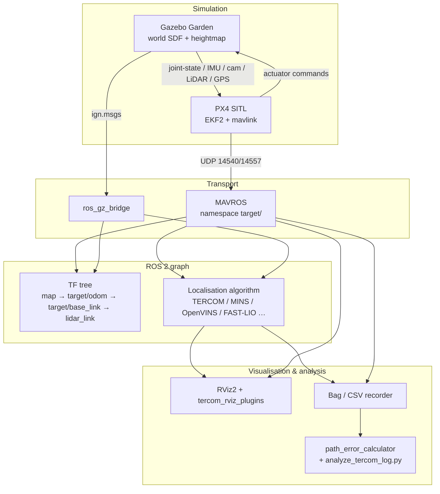
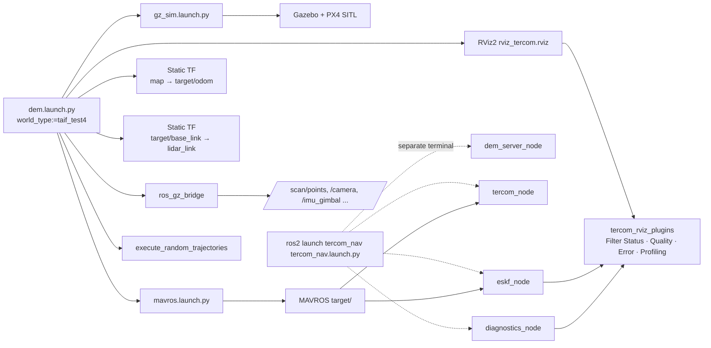
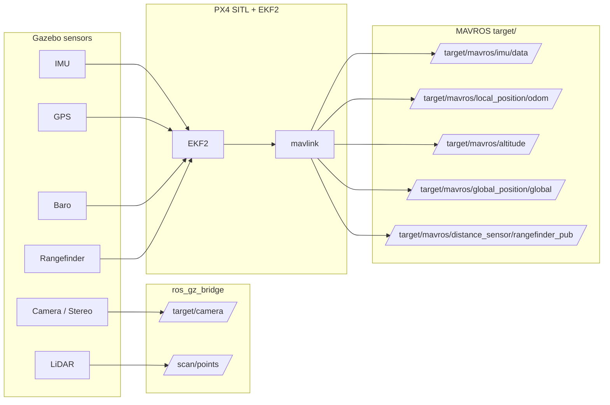
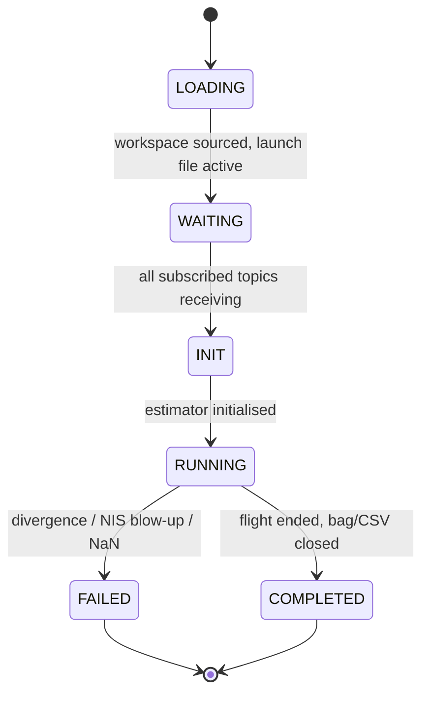
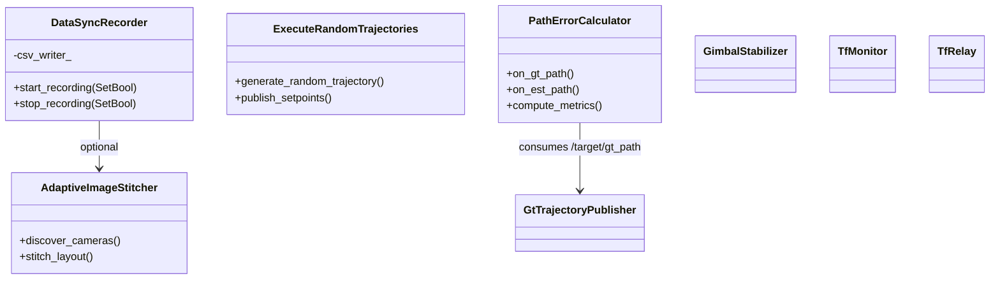

# System Architecture

Mermaid diagrams of the full `gps_denied_navigation_sim` stack — from Gazebo down through PX4 SITL, MAVROS and the `ros_gz_bridge` into user-space ROS 2 algorithms.

---

## 1. High-level stack



---

## 2. Default `dem.launch.py` launch graph (mono + TERCOM)



---

## 3. ROS topics published by the simulator

Per UAV (namespace `target`):

| Topic | Type | Source |
|-------|------|--------|
| `/target/mavros/imu/data` | `sensor_msgs/Imu` | MAVROS |
| `/target/mavros/altitude` | `mavros_msgs/Altitude` | MAVROS |
| `/target/mavros/distance_sensor/rangefinder_pub` | `sensor_msgs/Range` | MAVROS |
| `/target/mavros/global_position/global` | `sensor_msgs/NavSatFix` | MAVROS |
| `/target/mavros/local_position/odom` | `nav_msgs/Odometry` | MAVROS |
| `/target/mavros/local_position/velocity_local` | `geometry_msgs/TwistStamped` | MAVROS |
| `/target/mavros/local_position/pose` | `geometry_msgs/PoseStamped` | MAVROS |
| `/target/gt_path` | `nav_msgs/Path` | `gt_trajectory_publisher` |
| `/target/camera` + `/target/camera_info` | `sensor_msgs/Image / CameraInfo` | `ros_gz_bridge` |
| `/target/gimbal/camera` + `/target/gimbal/camera_info` | same | `ros_gz_bridge` |
| `/scan/points` | `sensor_msgs/PointCloud2` | `ros_gz_bridge` |
| `/target/stereo/{left,right}_cam/image_raw` | `sensor_msgs/Image` | `ros_gz_bridge` (stereo UAV) |
| `/target/velodyne_{front,rear}/points` | `sensor_msgs/PointCloud2` | `ros_gz_bridge` (twin UAV) |
| `/imu_gimbal` | `sensor_msgs/Imu` | `ros_gz_bridge` |
| `/clock` | `rosgraph_msgs/Clock` | `ros_gz_bridge` |

TF tree published:

```
map
 └── target/odom          (static, from dem.launch.py)
      └── target/base_link          (dynamic, from MAVROS local_position)
           ├── target/base_link_frd (NED flavour, MAVROS)
           └── lidar_link           (static, from dem.launch.py)
```

---

## 4. Per-UAV ROS graph



---

## 5. State of an algorithm-under-test



---

## 6. Module classes (Python nodes inside `gps_denied_navigation_sim/`)



---

## See also

- [`TERCOM.md`](TERCOM.md) for the TERCOM-specific mermaid diagrams
- [`ALGORITHM_ANALYSIS.md`](ALGORITHM_ANALYSIS.md) for the comparison pipeline
- [`tercom_nav/docs/TERCOM_MERMAID_DIAGRAMS.md`](../../tercom_nav/docs/TERCOM_MERMAID_DIAGRAMS.md) for the algorithm-internal view
