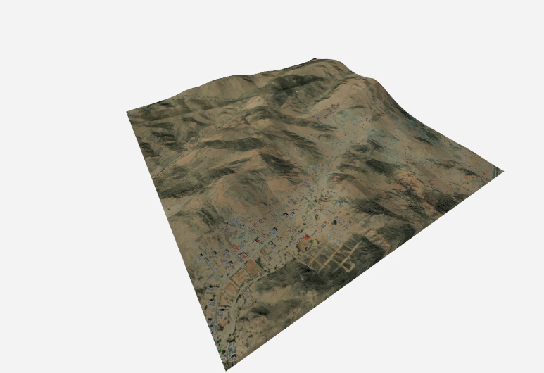
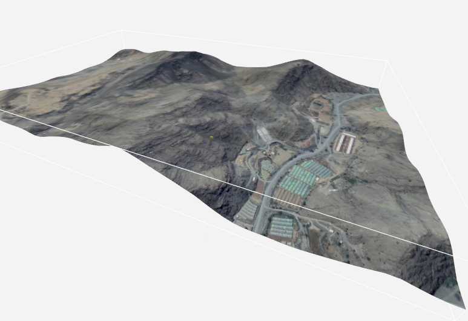
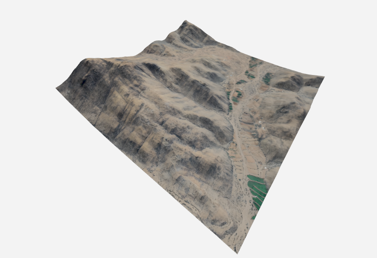
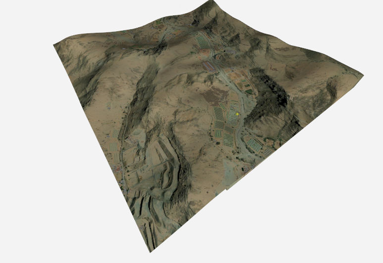
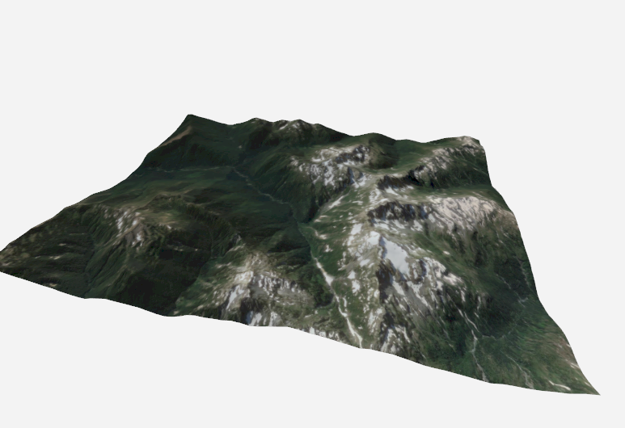
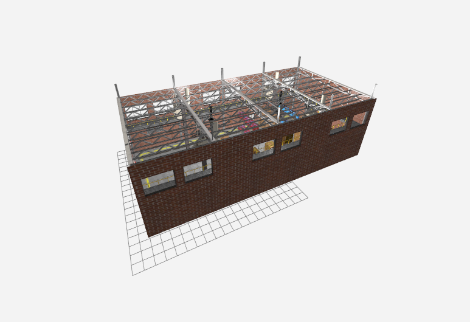

# Simulation Environment

The simulator ships with **six Gazebo worlds** — one indoor warehouse and five outdoor terrains. All outdoor worlds use real-world digital elevation data (Mapbox Terrain DEM / SRTM / NASA ASTER) reprojected to local ENU. Spawn coordinates, world origin, and physics parameters for each world are collected in [`worlds/WORLD_PARAMETERS.md`](../worlds/WORLD_PARAMETERS.md).

| World | Environment | Location | Alias suffix |
|-------|-------------|----------|--------------|
| [`tugbot_depot`](#tugbot_depot) | Indoor warehouse | Synthetic | `*_tug` |
| [`taif_world`](#taif_world) | Mountainous DEM | Taif, Saudi Arabia | `*_taif` |
| [`taif1_world`](#taif1_world) | Mountainous DEM (alt.) | Taif, Saudi Arabia | `*_taif1` |
| [`taif_test`](#taif_test) | DEM test sandbox | Taif, Saudi Arabia | — |
| [`taif_test4`](#taif_test4) | Heightmap DEM (default) | Taif, Saudi Arabia | `*_taif4` |
| [`dem_world`](#dem_world) | Generic SRTM DEM | Pacific Northwest (US/CA) | — |

---

## Gallery

| `taif_test4` (default) | `taif_world` | `taif1_world` |
|:-:|:-:|:-:|
|  |  |  |

| `taif_test` | `dem_world` | `tugbot_depot` |
|:-:|:-:|:-:|
|  |  |  |

---

## tugbot_depot

Indoor warehouse, **30 m × 15 m × 9 m**, 463 m² floor area. Structured boxes / pillars / shelving for obstacle-avoidance and SLAM development. Geographic origin: 47.3979°N, 8.5461°E (Zürich area).

Launch (e.g. with stereo UAV):

```bash
stereo_tug
# → ros2 launch gps_denied_navigation_sim dem_stereo.launch.py world_type:=tugbot_depot
```

Full specs in [`worlds/WORLD_PARAMETERS.md`](../worlds/WORLD_PARAMETERS.md#1-tugbot-depot-world-tugbot_depotsdf).

---

## taif_world

Mountainous DEM of the Taif region (Saudi Arabia). Uses the shipped `taif_dem` model (Collada mesh). World origin: 21.270°N, 40.347°E, 1874.6 m MSL.

```bash
mono_taif        # x500_mono_cam_3d_lidar
stereo_taif      # x500_stereo_cam_3d_lidar
twin_taif        # x500_twin_stereo_twin_velodyne
```

## taif1_world

Alternative Taif DEM (`taif1_dem` model). Same geographic region, different tile extent.

```bash
mono_taif1   stereo_taif1   twin_taif1
```

## taif_test

Single-tile DEM sandbox used for quickly debugging heightmap placement and spherical coordinates. Not recommended for benchmark runs.

## taif_test4

**Default world for TERCOM.** Uses a Gazebo `<heightmap>` mesh rendered directly from `taif_test4_height_map.tif` with a matching georeferenced `taif_test4_tercom_dem.tif` consumed by `tercom_nav`.

- World origin: `21.265059957990964°N, 40.354156494140625°E, 1859.7 m MSL`
- Heightmap `<pos>`: `(71.26, -70.86, 0)` m
- Heightmap `<size>`: `2708.27 × 2692.29 × 285.9` m
- DEM elevation range: `1725.4 – 2011.1 m MSL`

See [`tercom_nav/docs/MAP_OFFSET.md`](../../tercom_nav/docs/MAP_OFFSET.md) for the full derivation of the `map → target/odom` static TF and `dem_pos_offset` required to align MAVROS, the ESKF, and the DEM cloud in RViz.

```bash
mono_taif4       # default with TERCOM
stereo_taif4
twin_taif4
```

## dem_world

Generic SRTM-derived DEM tile over the Pacific Northwest (Washington / British Columbia). Good as a second terrain type for cross-geography generalisation experiments.

---

## Physics & Environment (all worlds)

| Parameter | Value |
|-----------|-------|
| Physics engine | ODE |
| Max step size | 4 ms |
| Real-time factor | 1.0 |
| Update rate | 250 Hz |
| Gravity | `(0, 0, -9.8) m/s²` |
| Magnetic field | `(6e-6, 2.3e-5, -4.2e-5) T` |
| Camera near / far clip | `0.25 m / 50 000 m` |

Systems enabled in every world: Physics, UserCommands, SceneBroadcaster, Contact, IMU, AirPressure, ApplyLinkWrench, NavSat, Sensors (Ogre2).

---

## How to change the world

Three equivalent approaches.

### 1. Use an alias

```bash
mono_taif4       # or stereo_taif4 / twin_taif4
```

### 2. Launch with `world_type:=<world>`

```bash
ros2 launch gps_denied_navigation_sim dem.launch.py world_type:=taif_test4
```

Valid values (from `launch/dem.launch.py`):
`taif_world`, `taif1_world`, `dem_world`, `tugbot_depot`, `taif_test4`.

### 3. Add your own world

1. Put your SDF into `worlds/<mine>.sdf` (world origin must be set with `<spherical_coordinates>`).
2. Put the DEM model (if any) in `models/<mine>_dem/`.
3. `install.sh` copies `worlds/*` and `models/*` into `PX4-Autopilot/Tools/simulation/gz/` — re-run it or copy manually.
4. Add a `world_type == '<mine>'` branch in `launch/dem.launch.py` (and/or `dem_stereo`, `dem_twin_stereo`) with the correct spawn `xpos / ypos / zpos`. Use the helper below to pick a safe altitude.

---

## GPS to ENU Coordinate Conversion

The script `gps_to_enu.py` (located in the `scripts` directory) converts WGS84 GPS coordinates (latitude, longitude) into local ENU (East, North, Up) coordinates for the Gazebo simulation.

This script is compatible with terrain and maps generated by the [gazebo_terrain_generator](https://github.com/mzahana/gazebo_terrain_generator). It handles both georeferenced GeoTIFFs and standard Gazebo heightmaps by automatically reading dimensions and offsets from the `model.sdf` file.

### Usage

```bash
python3 scripts/gps_to_enu.py \
  --center-lat <MAP_ORIGIN_LAT> \
  --center-lon <MAP_ORIGIN_LON> \
  --target-lat <TARGET_LAT> \
  --target-lon <TARGET_LON> \
  --tif-file <PATH_TO_HEIGHTMAP_TIF>
```

**Note**: The output **Z** coordinate represents the **absolute elevation** in the Gazebo world coordinate system (where the minimum altitude is zero). Upon execution, Gazebo should display a `quadcopter` and `DEM`.

### Companion utility — spawn elevation lookup

If you already know the ENU (X, Y) where you want to spawn and just need the ground altitude, use [`scripts/get_elevation_at_xy.py`](../scripts/get_elevation_at_xy.py) — it samples the heightmap `.tif`:

```bash
python3 scripts/get_elevation_at_xy.py --x 250.0 --y -100.0 \
  --tif-file models/taif_test4/textures/taif_test4_height_map.tif
```

It prints the raw elevation and a recommended spawn `z = elev + 0.5 m` buffer.

---

## See also

- [`worlds/WORLD_PARAMETERS.md`](../worlds/WORLD_PARAMETERS.md) — per-world specs
- [`generate_dem.md`](../generate_dem.md) — build a new DEM from Mapbox / SRTM
- [`tercom_nav/docs/MAP_OFFSET.md`](../../tercom_nav/docs/MAP_OFFSET.md) — aligning ESKF, TF tree and DEM pointcloud for a new world
