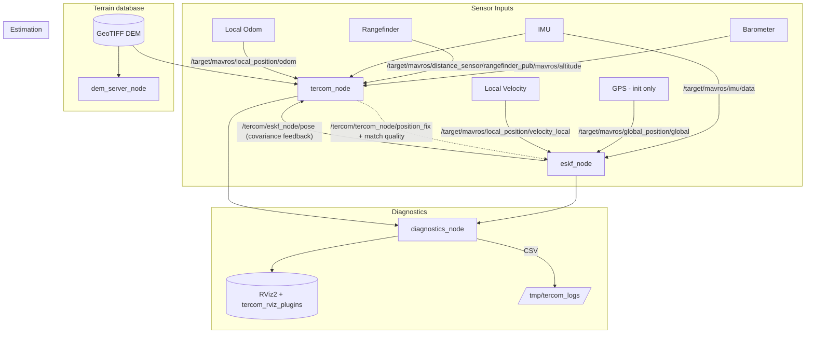
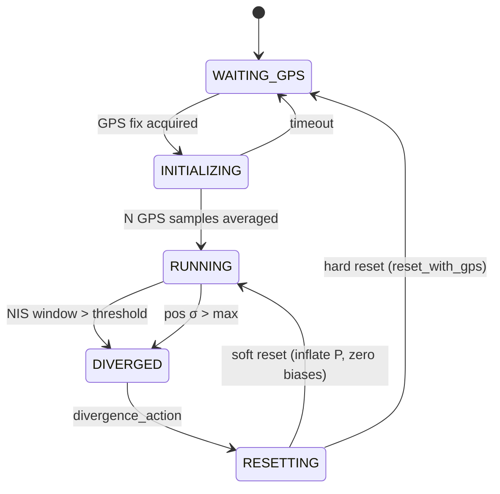
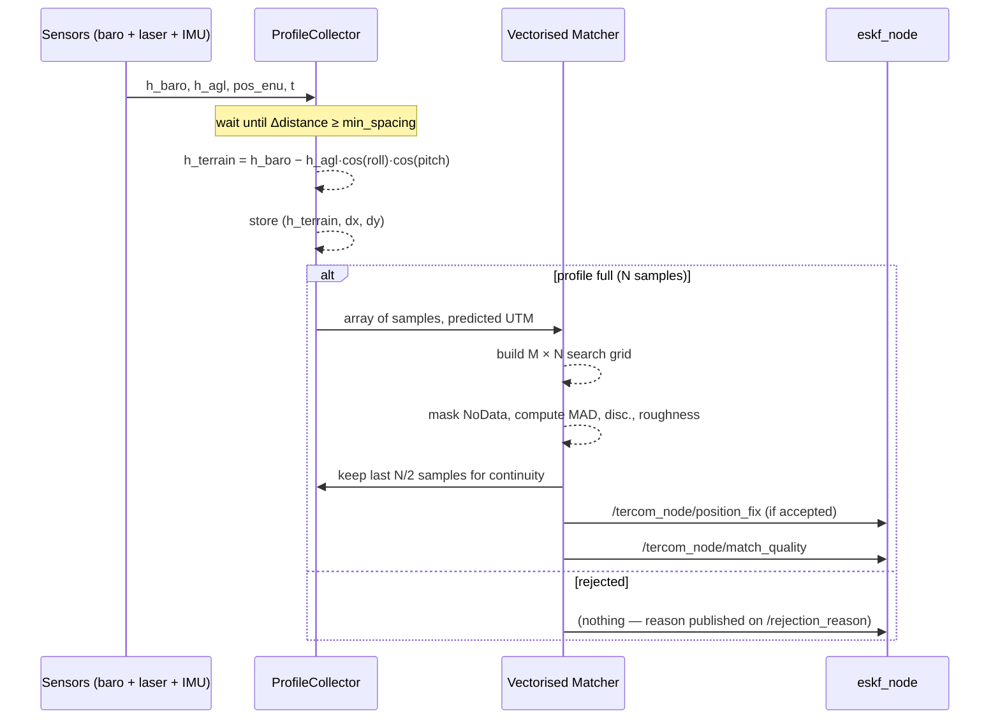
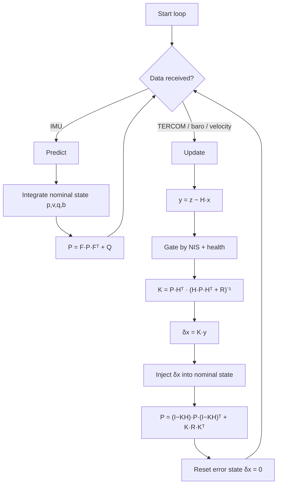
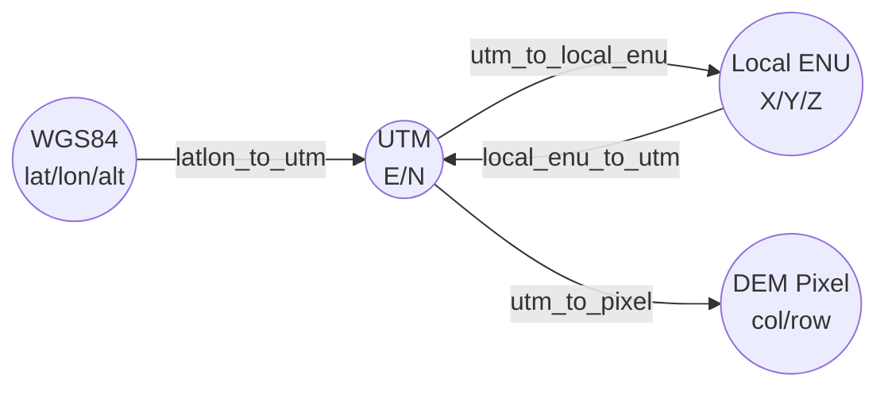

# TERCOM — Terrain Contour Matching

**TERCOM (Terrain Contour Matching)** is the default GPS-denied navigation algorithm used by this simulator. It estimates UAV position without GPS by correlating a live terrain elevation profile (baro + rangefinder) against a pre-loaded Digital Elevation Model (DEM), fused with an **Error-State Kalman Filter (ESKF)** running on IMU prediction.

GPS is used only **once at startup** to initialize the filter; after that, position comes from IMU + TERCOM + baro + velocity updates.

This page is a high-level entry point. Full reference documentation lives in the two companion repositories:

- [`tercom_nav`](https://github.com/mzahana/tercom_nav) — the estimator package (4 nodes)
- [`tercom_rviz_plugins`](https://github.com/mzahana/tercom_rviz_plugins) — the dockable RViz2 panels
- [`tercom_nav/docs/TERCOM_MERMAID_DIAGRAMS.md`](../../tercom_nav/docs/TERCOM_MERMAID_DIAGRAMS.md) — in-depth architecture diagrams
- [`tercom_nav/docs/MAP_OFFSET.md`](../../tercom_nav/docs/MAP_OFFSET.md) — DEM / TF alignment for new worlds

---

## Quick start on `taif_test4`

```bash
# Terminal 1
zenoh

# Terminal 2 — sim
mono_taif4

# Terminal 3 — TERCOM
tercom
```

The `tercom` alias expands to:

```bash
ros2 launch tercom_nav tercom_nav.launch.py \
    params_file:=$(ros2 pkg prefix tercom_nav)/share/tercom_nav/config/taif_test4_params.yaml \
    mavros_ns:=target/mavros
```

The pre-configured RViz layout (loaded automatically by `dem.launch.py`) docks the custom panels from `tercom_rviz_plugins`:

| Panel | Shows |
|-------|-------|
| **Filter Status** | ESKF state machine, NIS sparkline, pos σ / innovation gauges, IMU biases |
| **TERCOM Quality** | Pipeline state, per-match MAD / discrimination / roughness / noise, accepted / rejected counters |
| **Error History** | Live horizontal + vertical error vs. ground truth with RMS / max overlays |
| **Profiling** | Per-callback exec time and call rate for all three `tercom_nav` nodes |

---

## Nodes

| Node | Responsibility |
|------|----------------|
| `dem_server_node` | Loads the GeoTIFF DEM once, publishes metadata on a latched topic, exposes ROS services for elevation queries |
| `tercom_node` | Collects time-synchronised baro + rangefinder + IMU + odometry samples; runs vectorised NumPy TERCOM correlation matching against the DEM |
| `eskf_node` | 15-state ESKF (position / velocity / attitude / accel bias / gyro bias); fuses IMU prediction with TERCOM, baro, and velocity updates |
| `diagnostics_node` | Ground-truth error metrics, RViz visualisations (paths, fixes, covariance ellipse, DEM cloud), CSV logging, and the aggregated `/profiling` topic |

---

## System architecture



## ESKF state machine



## TERCOM match lifecycle



## Filter lifecycle (predict + update)



## Coordinate chain



---

## Topics (the ones you care about)

| Topic | Type | Description |
|-------|------|-------------|
| `/tercom/eskf_node/odom` | `nav_msgs/Odometry` | **Primary output** — position/orientation in `map` frame |
| `/tercom/eskf_node/global` | `sensor_msgs/NavSatFix` | Estimated lat/lon/alt (1 Hz) |
| `/tercom/eskf_node/health` | `std_msgs/Float32MultiArray` | `[avg_NIS, max_pos_std, innov_norm, is_healthy]` |
| `/tercom/eskf_node/state` | `std_msgs/String` | Filter state machine |
| `/tercom/tercom_node/position_fix` | `geometry_msgs/PointStamped` | Accepted UTM fix |
| `/tercom/tercom_node/match_quality` | `std_msgs/Float32MultiArray` | `[MAD, disc., roughness, noise]` |
| `/tercom/tercom_node/status` | `std_msgs/String` | `WAITING_SENSORS` / `COLLECTING` / `MATCHING` |
| `/tercom/diagnostics_node/estimated_path` | `nav_msgs/Path` | ESKF trajectory |
| `/tercom/diagnostics_node/ground_truth_path` | `nav_msgs/Path` | MAVROS trajectory (frame-aligned) |
| `/tercom/diagnostics_node/error_arrow` | `visualization_msgs/MarkerArray` | Live error arrow GT → EST |
| `/tercom/diagnostics_node/dem_surface` | `sensor_msgs/PointCloud2` | DEM cloud (satellite-coloured if configured) |
| `/tercom/diagnostics_node/profiling` | `std_msgs/Float32MultiArray` | 16-float aggregated timing for all nodes |

A full topic + service + parameter reference is in the `tercom_nav` [README](https://github.com/mzahana/tercom_nav#readme).

---

## Using a different world

1. Produce a georeferenced GeoTIFF DEM covering the flight area ([`generate_dem.md`](../generate_dem.md)).
2. Copy it next to the world model (e.g. `models/<world>/textures/<world>_tercom_dem.tif`).
3. Duplicate `tercom_nav/config/taif_test4_params.yaml` as `<world>_params.yaml`; update:
   - `dem_file:` absolute path to the new GeoTIFF
   - `world_origin_lat/lon/alt:` matches the world SDF's `<spherical_coordinates>`
   - `dem_pos_offset:` computed per [`MAP_OFFSET.md`](../../tercom_nav/docs/MAP_OFFSET.md)
   - `dem_satellite_image:` + `dem_satellite_bounds:` if you want satellite-coloured DEM cloud
4. Launch:
   ```bash
   ros2 launch tercom_nav tercom_nav.launch.py params_file:=/abs/path/<world>_params.yaml
   ```

---

## See also

- [`ALGORITHMS.md`](ALGORITHMS.md) — other estimators you can benchmark against TERCOM
- [`ALGORITHM_ANALYSIS.md`](ALGORITHM_ANALYSIS.md) — CSV / figure pipeline for per-run analysis
- [`ARCHITECTURE.md`](ARCHITECTURE.md) — where TERCOM sits in the full simulator graph
