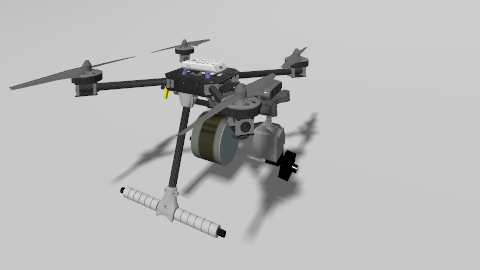
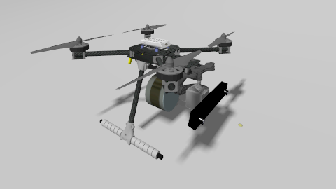
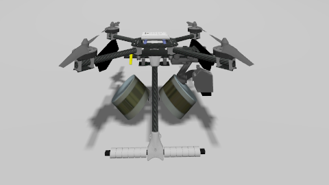

# UAV Models

Three X500-derived multirotors are shipped with the simulator. Every variant is built on the stock PX4 `x500` airframe and adds a different camera / LiDAR payload. All three share the same MAVROS namespace (`target`) and the same flight-controller parameters, so swapping between them requires only changing the launch file or the alias.

| Model | Sensors |
|-------|---------|
| [`x500_mono_cam_3d_lidar`](#x500_mono_cam_3d_lidar) | IMU + Baro + GPS + Monocular downward camera + Gimbal + 3D LiDAR + Rangefinder |
| [`x500_stereo_cam_3d_lidar`](#x500_stereo_cam_3d_lidar) | IMU + Baro + GPS + Stereo camera pair + Gimbal + 3D LiDAR + Rangefinder |
| [`x500_twin_stereo_twin_velodyne`](#x500_twin_stereo_twin_velodyne) | IMU + Baro + GPS + 2× stereo pairs (front+rear) + 2× Velodyne VLP-16 + Rangefinder |

All models are installed into `PX4-Autopilot/Tools/simulation/gz/models/` by `install.sh` so PX4 can spawn them directly with `PX4_GZ_MODEL=<model>`.

---

## Gallery

| x500_mono_cam_3d_lidar | x500_stereo_cam_3d_lidar | x500_twin_stereo_twin_velodyne |
|:-:|:-:|:-:|
|  |  |  |
| TERCOM · MINS-mono · OpenVINS-mono · FAST-LIO · FAST-LIVO2 · SPARK | MINS-stereo · OpenVINS-stereo · ORB-SLAM3 · RTAB-Map · FAST-LIO · FAST-LIVO2 | MINS twin-stereo · FAST-LIO (on either Velodyne) |

---

## x500_mono_cam_3d_lidar

Minimal payload intended for **terrain-aided navigation** and **monocular VIO** benchmarks. It is the default UAV for [TERCOM](TERCOM.md).

| Sensor | Topic (after MAVROS / `ros_gz_bridge`) | Rate |
|--------|----------------------------------------|------|
| IMU | `/target/mavros/imu/data` | 250 Hz |
| GPS | `/target/mavros/global_position/global` | 5 Hz |
| Baro | `/target/mavros/altitude` | 10 Hz |
| Rangefinder | `/target/mavros/distance_sensor/rangefinder_pub` | 10 Hz |
| Mono camera | `/target/camera` + `/target/camera_info` | 30 Hz |
| Gimbal camera | `/target/gimbal/camera` + `/target/gimbal/camera_info` | 30 Hz |
| 3D LiDAR (scan) | `/scan/points` (`sensor_msgs/PointCloud2`) | 10 Hz |
| Gimbal IMU | `/imu_gimbal` | 250 Hz |

Launch aliases:

```bash
mono_tug    # tugbot_depot
mono_taif   # taif_world
mono_taif1  # taif1_world
mono_taif4  # taif_test4  (default for TERCOM)
```

Source SDF: [`models/x500_mono_cam_3d_lidar/model.sdf`](../models/x500_mono_cam_3d_lidar/model.sdf).

---

## x500_stereo_cam_3d_lidar

Stereo + LiDAR build for **stereo VIO / VI-SLAM** (MINS, OpenVINS, ORB-SLAM3, RTAB-Map) and LiDAR-inertial odometry.

| Sensor | Topic |
|--------|-------|
| IMU | `/target/mavros/imu/data` |
| GPS / Baro / Rangefinder | same as above |
| Stereo left | `/target/stereo/left_cam/image_raw` + `/target/stereo/left_cam/camera_info` |
| Stereo right | `/target/stereo/right_cam/image_raw` + `/target/stereo/right_cam/camera_info` |
| Gimbal camera | `/target/gimbal/camera` |
| 3D LiDAR | `/scan/points` |

Launch aliases:

```bash
stereo_tug    stereo_taif    stereo_taif1    stereo_taif4
```

Source SDF: [`models/x500_stereo_cam_3d_lidar/model.sdf`](../models/x500_stereo_cam_3d_lidar/model.sdf).

---

## x500_twin_stereo_twin_velodyne

Heavy payload designed for **multi-sensor fusion** research. Four cameras (front/rear × left/right) plus two Velodyne VLP-16 LiDARs give full 360° perception.

| Sensor | Topic |
|--------|-------|
| Front stereo left/right | `/target/front_stereo/{left,right}_cam/image_raw` |
| Rear stereo left/right | `/target/rear_stereo/{left,right}_cam/image_raw` |
| Velodyne (front) | `/target/velodyne_front/points` |
| Velodyne (rear) | `/target/velodyne_rear/points` |
| IMU / Baro / GPS | same as above |

Launch aliases:

```bash
twin_tug    twin_taif    twin_taif1    twin_taif4
```

Source SDF: [`models/x500_twin_stereo_twin_velodyne/model.sdf`](../models/x500_twin_stereo_twin_velodyne/model.sdf).

Use the [`adaptive_image_stitcher`](adaptive_image_stitcher.md) to visualise all four cameras in a single RViz display.

---

## How to switch UAV model

There are three equivalent ways.

### 1. Use a pre-made alias

Simplest and recommended.

```bash
mono_taif4      # x500_mono_cam_3d_lidar   on taif_test4
stereo_taif4    # x500_stereo_cam_3d_lidar on taif_test4
twin_taif4      # x500_twin_stereo_twin_velodyne on taif_test4
```

### 2. Invoke the launch file directly

```bash
ros2 launch gps_denied_navigation_sim dem.launch.py            world_type:=taif_test4   # mono
ros2 launch gps_denied_navigation_sim dem_stereo.launch.py     world_type:=taif_test4   # stereo
ros2 launch gps_denied_navigation_sim dem_twin_stereo.launch.py world_type:=taif_test4  # twin
```

Each of these launch files sets `m_name` (the Gazebo model) internally:

| Launch file | `m_name` |
|---|---|
| `dem.launch.py` | `x500_mono_cam_3d_lidar` |
| `dem_stereo.launch.py` | `x500_stereo_cam_3d_lidar` |
| `dem_twin_stereo.launch.py` | `x500_twin_stereo_twin_velodyne` |

### 3. Add a new UAV

1. Drop your SDF into `models/<your_model>/model.sdf`.
2. `install.sh` copies `models/*` into `PX4-Autopilot/Tools/simulation/gz/models/` — re-run it, or copy manually:
   ```bash
   cp -r models/<your_model> $PX4_DIR/Tools/simulation/gz/models/
   ```
3. If the model needs a new PX4 airframe, drop it in `config/px4/<id>_<name>` and point `install.sh` to copy it into `ROMFS/px4fmu_common/init.d-posix/airframes/`.
4. Duplicate `launch/dem.launch.py`, change `m_name` to your model, and update `config/mavros/` if sensor topics/frames differ.
5. Add an alias in `scripts/bash.sh` following the existing pattern.
6. Rebuild PX4 SITL: `cd $PX4_DIR && make px4_sitl`.

---

## See also

- [`SIMULATION_ENVIRONMENT.md`](SIMULATION_ENVIRONMENT.md) — which worlds each UAV can fly in
- [`ALGORITHMS.md`](ALGORITHMS.md) — which algorithm pairs well with which UAV
- [`adaptive_image_stitcher.md`](adaptive_image_stitcher.md) — single-topic visualisation for any camera count
